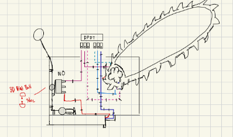
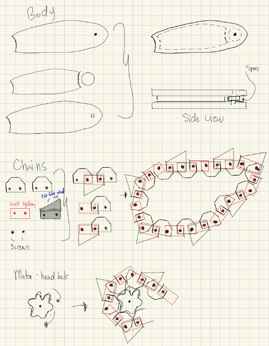
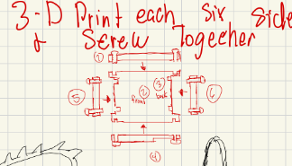

### Circuit Sketch
The following conceptual sketch illustrates the wiring between the power source, motor driver, and the switches.

### Mechanical Design
Sketches for the physical chainsaw and assembly components.

